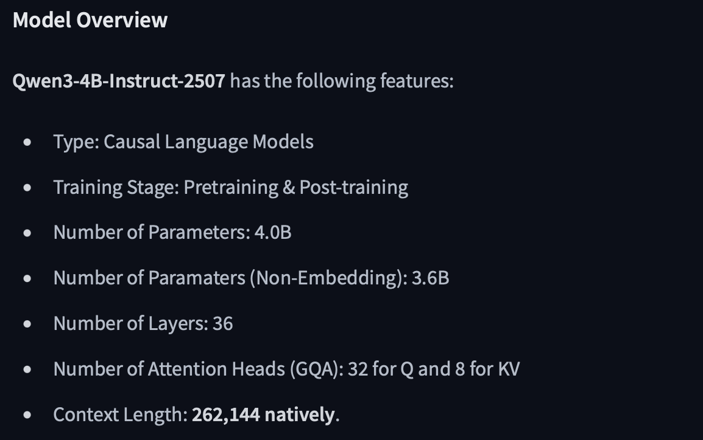
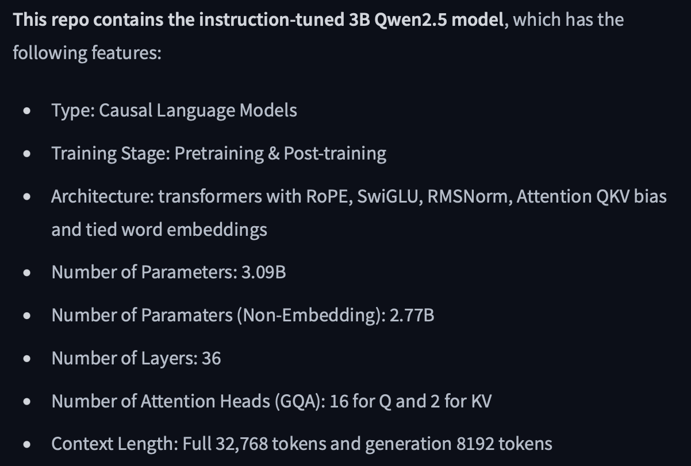

# 🌏 Environmental Issues Extractor

## 📑 Project Description
Supervised fine-tuned LLM that detects and quantifies environment issues from 10,000+ environmental article titles.

## 📦 Distillation LLMs
### 👩🏻‍🏫 Selected Teacher: Qwen/Qwen3-4B-Instruct-2507
**https://huggingface.co/Qwen/Qwen3-4B-Instruct-2507**



Send 10,000+ environmental article titles to the teacher LLM,
letting it extract and quantify environmental issues and save all results.

### 👨🏻‍🎓 Selected Student: Qwen/Qwen2.5-3B-Instruct
**https://huggingface.co/Qwen/Qwen2.5-3B-Instruct**



Split 80% of the teacher's extracted and quantified issues to fine-tune the student LLM,
and 20% for the evaluation on student LLM.

## 📊 Evaluation Metrics
#### MAE: 0.0038806808544477205
#### RMSE: 0.029841735729631162
#### Total samples: 2187

## 📲 Example Issues Extraction

```json
{
  "title": "Thames Water fined \u00a32.3m for raw sewage pollution incident",
  "issues": {
    "bird activity": 8,
    "climate change": 9,
    "floods": 10,
    "water pollution": 7
  }
}
```